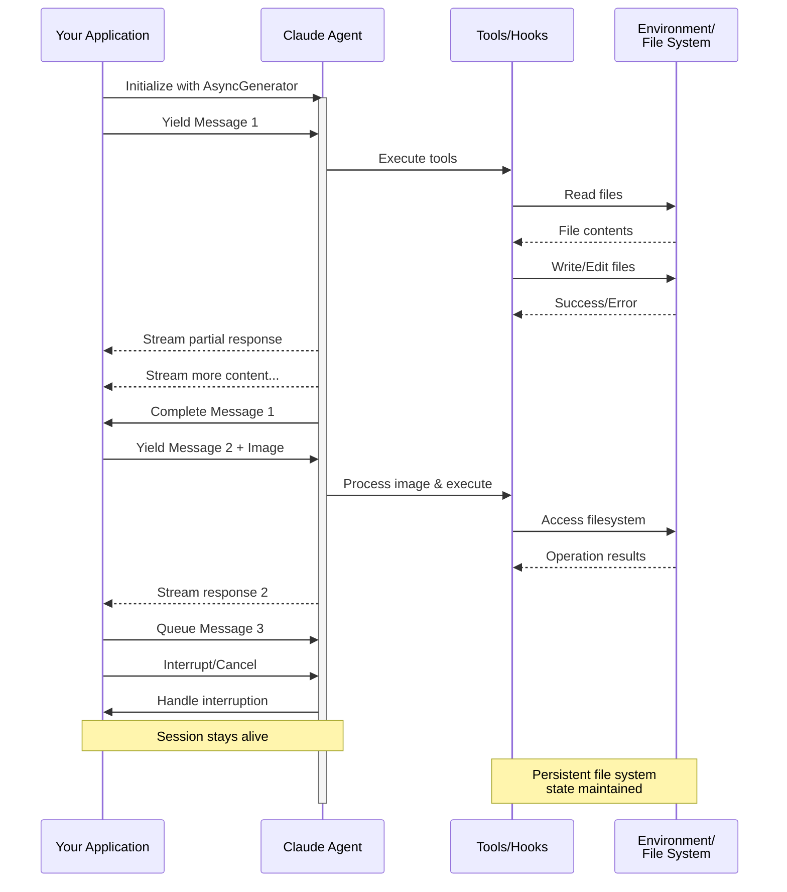

# Stream responses in real-time

Get real-time responses from the Agent SDK as text and tool calls stream in

---

By default, the Agent SDK yields complete `AssistantMessage` objects after Claude finishes generating each response. To receive incremental updates as text and tool calls are generated, enable partial message streaming by setting `include_partial_messages` (Python) or `includePartialMessages` (TypeScript) to `true` in your options.

> **Tip:** This page covers output streaming (receiving tokens in real-time). For input modes (how you send messages), see [Send messages to agents](/docs/en/agent-sdk/streaming-vs-single-mode). You can also [stream responses using the Agent SDK via the CLI](https://code.claude.com/docs/en/headless).

## Enable streaming output

To enable streaming, set `include_partial_messages` (Python) or `includePartialMessages` (TypeScript) to `true` in your options. This causes the SDK to yield `StreamEvent` messages containing raw API events as they arrive, in addition to the usual `AssistantMessage` and `ResultMessage`.

Your code then needs to:

1. Check each message's type to distinguish `StreamEvent` from other message types
2. For `StreamEvent`, extract the `event` field and check its `type`
3. Look for `content_block_delta` events where `delta.type` is `text_delta`, which contain the actual text chunks

The example below enables streaming and prints text chunks as they arrive. Notice the nested type checks: first for `StreamEvent`, then for `content_block_delta`, then for `text_delta`:

```typescript
import { query } from "@anthropic-ai/claude-agent-sdk";

for await (const message of query({
  prompt: "List the files in my project",
  options: {
    includePartialMessages: true,
    allowedTools: ["Bash", "Read"],
  },
})) {
  if (message.type === "stream_event") {
    const event = message.event;
    if (event.type === "content_block_delta") {
      if (event.delta.type === "text_delta") {
        process.stdout.write(event.delta.text);
      }
    }
  }
}
```

## StreamEvent reference

When partial messages are enabled, you receive raw Claude API streaming events wrapped in an object. The type has different names in each SDK:

- **Python**: `StreamEvent` (import from `claude_agent_sdk.types`)
- **TypeScript**: `SDKPartialAssistantMessage` with `type: 'stream_event'`

Both contain raw Claude API events, not accumulated text. You need to extract and accumulate text deltas yourself. Here's the structure of each type:

```typescript
type SDKPartialAssistantMessage = {
  type: "stream_event";
  event: RawMessageStreamEvent; // From Anthropic SDK
  parent_tool_use_id: string | null;
  uuid: UUID;
  session_id: string;
};
```

The `event` field contains the raw streaming event from the [Claude API](/docs/en/build-with-claude/streaming#event-types). Common event types include:

| Event Type            | Description                                     |
| :-------------------- | :---------------------------------------------- |
| `message_start`       | Start of a new message                          |
| `content_block_start` | Start of a new content block (text or tool use) |
| `content_block_delta` | Incremental update to content                   |
| `content_block_stop`  | End of a content block                          |
| `message_delta`       | Message-level updates (stop reason, usage)      |
| `message_stop`        | End of the message                              |

## Message flow

With partial messages enabled, you receive messages in this order:

```
StreamEvent (message_start)
StreamEvent (content_block_start) - text block
StreamEvent (content_block_delta) - text chunks...
StreamEvent (content_block_stop)
StreamEvent (content_block_start) - tool_use block
StreamEvent (content_block_delta) - tool input chunks...
StreamEvent (content_block_stop)
StreamEvent (message_delta)
StreamEvent (message_stop)
AssistantMessage - complete message with all content
... tool executes ...
... more streaming events for next turn ...
ResultMessage - final result
```

Without partial messages enabled (`include_partial_messages` in Python, `includePartialMessages` in TypeScript), you receive all message types except `StreamEvent`. Common types include `SystemMessage` (session initialization), `AssistantMessage` (complete responses), `ResultMessage` (final result), and `CompactBoundaryMessage` (indicates when conversation history was compacted).

## Stream text responses

To display text as it's generated, look for `content_block_delta` events where `delta.type` is `text_delta`. These contain the incremental text chunks. The example below prints each chunk as it arrives:

```typescript
import { query } from "@anthropic-ai/claude-agent-sdk";

for await (const message of query({
  prompt: "Explain how databases work",
  options: { includePartialMessages: true },
})) {
  if (message.type === "stream_event") {
    const event = message.event;
    if (
      event.type === "content_block_delta" &&
      event.delta.type === "text_delta"
    ) {
      process.stdout.write(event.delta.text);
    }
  }
}

console.log(); // Final newline
```

## Stream tool calls

Tool calls also stream incrementally. You can track when tools start, receive their input as it's generated, and see when they complete. The example below tracks the current tool being called and accumulates the JSON input as it streams in. It uses three event types:

- `content_block_start`: tool begins
- `content_block_delta` with `input_json_delta`: input chunks arrive
- `content_block_stop`: tool call complete

```typescript
import { query } from "@anthropic-ai/claude-agent-sdk";

// Track the current tool and accumulate its input JSON
let currentTool: string | null = null;
let toolInput = "";

for await (const message of query({
  prompt: "Read the README.md file",
  options: {
    includePartialMessages: true,
    allowedTools: ["Read", "Bash"],
  },
})) {
  if (message.type === "stream_event") {
    const event = message.event;

    if (event.type === "content_block_start") {
      // New tool call is starting
      if (event.content_block.type === "tool_use") {
        currentTool = event.content_block.name;
        toolInput = "";
        console.log(`Starting tool: ${currentTool}`);
      }
    } else if (event.type === "content_block_delta") {
      if (event.delta.type === "input_json_delta") {
        // Accumulate JSON input as it streams in
        const chunk = event.delta.partial_json;
        toolInput += chunk;
        console.log(`  Input chunk: ${chunk}`);
      }
    } else if (event.type === "content_block_stop") {
      // Tool call complete - show final input
      if (currentTool) {
        console.log(`Tool ${currentTool} called with: ${toolInput}`);
        currentTool = null;
      }
    }
  }
}
```

## Build a streaming UI

This example combines text and tool streaming into a cohesive UI. It tracks whether the agent is currently executing a tool (using an `inTool` flag) to show status indicators like `[Using Read...]` while tools run. Text streams normally when not in a tool, and tool completion triggers a "done" message. This pattern is useful for chat interfaces that need to show progress during multi-step agent tasks.

```typescript
import { query } from "@anthropic-ai/claude-agent-sdk";

// Track whether we're currently in a tool call
let inTool = false;

for await (const message of query({
  prompt: "Find all TODO comments in the codebase",
  options: {
    includePartialMessages: true,
    allowedTools: ["Read", "Bash", "Grep"],
  },
})) {
  if (message.type === "stream_event") {
    const event = message.event;

    if (event.type === "content_block_start") {
      if (event.content_block.type === "tool_use") {
        // Tool call is starting - show status indicator
        process.stdout.write(`\n[Using ${event.content_block.name}...]`);
        inTool = true;
      }
    } else if (event.type === "content_block_delta") {
      // Only stream text when not executing a tool
      if (event.delta.type === "text_delta" && !inTool) {
        process.stdout.write(event.delta.text);
      }
    } else if (event.type === "content_block_stop") {
      if (inTool) {
        // Tool call finished
        console.log(" done");
        inTool = false;
      }
    }
  } else if (message.type === "result") {
    // Agent finished all work
    console.log("\n\n--- Complete ---");
  }
}
```

## Known limitations

Some SDK features are incompatible with streaming:

- **Extended thinking**: when you explicitly set `max_thinking_tokens` (Python) or `maxThinkingTokens` (TypeScript), `StreamEvent` messages are not emitted. You'll only receive complete messages after each turn. Note that thinking is disabled by default in the SDK, so streaming works unless you enable it.
- **Structured output**: the JSON result appears only in the final `ResultMessage.structured_output`, not as streaming deltas. See [structured outputs](/docs/en/agent-sdk/structured-outputs) for details.

## Next steps

Now that you can stream text and tool calls in real-time, explore these related topics:

- [Interactive vs one-shot queries](/docs/en/agent-sdk/streaming-vs-single-mode): choose between input modes for your use case
- [Structured outputs](/docs/en/agent-sdk/structured-outputs): get typed JSON responses from the agent
- [Permissions](/docs/en/agent-sdk/permissions): control which tools the agent can use

# Streaming Input

Understanding the two input modes for Claude Agent SDK and when to use each

---

## Overview

The Claude Agent SDK supports two distinct input modes for interacting with agents:

- **Streaming Input Mode** (Default & Recommended) - A persistent, interactive session
- **Single Message Input** - One-shot queries that use session state and resuming

This guide explains the differences, benefits, and use cases for each mode to help you choose the right approach for your application.

## Streaming Input Mode (Recommended)

Streaming input mode is the **preferred** way to use the Claude Agent SDK. It provides full access to the agent's capabilities and enables rich, interactive experiences.

It allows the agent to operate as a long lived process that takes in user input, handles interruptions, surfaces permission requests, and handles session management.

### How It Works



### Benefits

- **Image Uploads**: Attach images directly to messages for visual analysis and understanding
- **Queued Messages**: Send multiple messages that process sequentially, with ability to interrupt
- **Tool Integration**: Full access to all tools and custom MCP servers during the session
- **Hooks Support**: Use lifecycle hooks to customize behavior at various points
- **Real-time Feedback**: See responses as they're generated, not just final results
- **Context Persistence**: Maintain conversation context across multiple turns naturally

### Implementation Example

```typescript
import { query } from "@anthropic-ai/claude-agent-sdk";
import { readFileSync } from "fs";

async function* generateMessages() {
  // First message
  yield {
    type: "user" as const,
    message: {
      role: "user" as const,
      content: "Analyze this codebase for security issues",
    },
  };

  // Wait for conditions or user input
  await new Promise((resolve) => setTimeout(resolve, 2000));

  // Follow-up with image
  yield {
    type: "user" as const,
    message: {
      role: "user" as const,
      content: [
        {
          type: "text",
          text: "Review this architecture diagram",
        },
        {
          type: "image",
          source: {
            type: "base64",
            media_type: "image/png",
            data: readFileSync("diagram.png", "base64"),
          },
        },
      ],
    },
  };
}

// Process streaming responses
for await (const message of query({
  prompt: generateMessages(),
  options: {
    maxTurns: 10,
    allowedTools: ["Read", "Grep"],
  },
})) {
  if (message.type === "result") {
    console.log(message.result);
  }
}
```

## Single Message Input

Single message input is simpler but more limited.

### When to Use Single Message Input

Use single message input when:

- You need a one-shot response
- You do not need image attachments, hooks, etc.
- You need to operate in a stateless environment, such as a lambda function

### Limitations

> **Warning:** Single message input mode does **not** support:
>
> - Direct image attachments in messages
> - Dynamic message queueing
> - Real-time interruption
> - Hook integration
> - Natural multi-turn conversations

### Implementation Example

```typescript
import { query } from "@anthropic-ai/claude-agent-sdk";

// Simple one-shot query
for await (const message of query({
  prompt: "Explain the authentication flow",
  options: {
    maxTurns: 1,
    allowedTools: ["Read", "Grep"],
  },
})) {
  if (message.type === "result") {
    console.log(message.result);
  }
}

// Continue conversation with session management
for await (const message of query({
  prompt: "Now explain the authorization process",
  options: {
    continue: true,
    maxTurns: 1,
  },
})) {
  if (message.type === "result") {
    console.log(message.result);
  }
}
```
